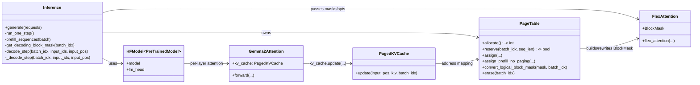
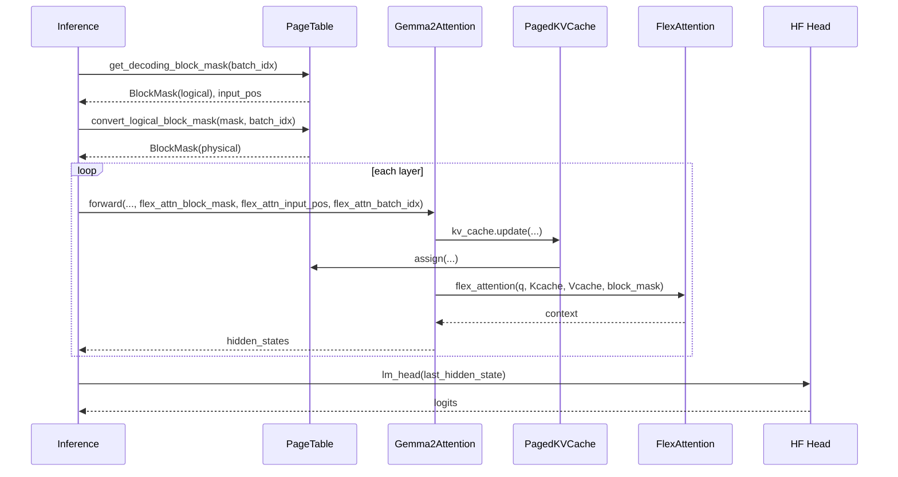

# Flex-Nano-vLLM — Mini Textbook & Implementation Guide

This is a step-by-step learning notebook for the [flex-nano-vLLM](https://github.com/changjonathanc/flex-nano-vllm) repo, aimed at **advanced Python developers** who want to implement an inference engine from scratch.

---

## 1. Overview

Flex-Nano-vLLM implements:
- **Paged KV cache** (memory pages shared across sequences)
- **Dynamic batching** (mix prefill + decode steps)
- **Preemption** (evict low-priority sequences to free memory)
- **FlexAttention** + **BlockMask** (efficient block-sparse attention)

You provide a **preloaded HuggingFace model** (`AutoModelForCausalLM`) and a tokenizer.  
The engine patches the model’s attention layers to use the paged cache.

---

## 2. Class hierarchy



3. High-level scheduling flow
   
```mermaid
    A[generate(requests)] --> B[tokenize -> Sequence objs]
    B --> C{waiting or running?}
    C -->|no| Z[return results]
    C -->|yes| D[run_one_step()]

    subgraph run_one_step
      D --> E{Can prefill new seqs?}
      E -->|yes| F[allocate batch_idx]
      F --> G[reserve pages for prompt]
      G --> H[build prefill BlockMask (no-paging)]
      H --> I[model.forward(..., flex_attn_*, mask)]
      I --> J[KV cache update]
      J --> K[sample token]
      K --> M[check_done -> free pages if finished]
      M --> N[unfinished -> running]
      N --> O[/return "prefill"/]
      E -->|no| P[decode step]
      P --> Q[reserve page if needed]
      Q --> R{out of pages?}
      R -->|yes| S[preempt newest running seq]
      R -->|no| T[form batch tensors]
      S --> T
      T --> U[get_decoding_block_mask(logical)]
      U --> V[convert to physical BlockMask]
      V --> W[decode_step(...)]
      W --> X[model.forward(..., flex_attn_*, mask)]
      X --> Y[sample token; check_done]
      Y --> O[/return "decode"/]
    end

    O --> C
```
4. One decode step (per layer)

5. Core components
PageTable

    Allocates/frees pages (allocate, erase)

    Maps logical (batch, block) to physical page index

    Translates BlockMasks from logical to physical space

PagedKVCache

    Holds big [1, H, N, D] k_cache / v_cache

    Writes keys/values via PageTable.assign calls

BlockMask

    Logical: per-sequence causal pattern

    Physical: remapped to unified cache

    mask_mod ensures no cross-sequence attention

6. Homework challenges

    1. Prefix sharing
    Extend PageTable to let two sequences point to same pages until they diverge.

    2. Sliding window
    Implement eviction of oldest pages to keep max length constant.

    3. Prefill+decode fusion
    Overlap prefill of new requests with decode of running ones.

7. How to run with a model
```python
from transformers import AutoModelForCausalLM, AutoTokenizer
from inference import Inference

model = AutoModelForCausalLM.from_pretrained(
    "google/gemma-2b-it",
    torch_dtype="bfloat16",
    device_map="cuda"
)
tokenizer = AutoTokenizer.from_pretrained("google/gemma-2b-it")

engine = Inference(
    model=model,
    tokenizer=tokenizer,
    max_batch_size=16,
    max_seq_length=2048,
    n_pages=256,
    page_size=128
)

results = engine.generate(["Hello world!", "Explain paged attention."])
```
